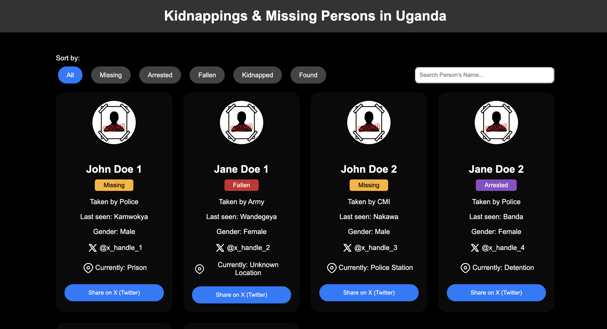

# Kidnappings & Missing Persons Uganda

This project lists Ugandans who might get arrested, detained, kidnapped, or go missing following the planned #March2Parliament protests on July 23, 2024.



## How to Contribute?

To contribute, you can edit `data.json` with correct details of the person that's been reported or presumed missing, arrested, or detained, and then send a Pull Request (PR).

**Contributing Code**

Click the 'Fork' button at the top right of this page to create a copy of this repository under your GitHub account.

**Clone the forked repository**:

```bash
git clone https://github.com/YOUR_GITHUB_USERNAME/missingpersons.git
cd missingpersons
```

**Create a new branch**:
```bash
git checkout -b your-feature-branch
```

**Make your changes**:

- Add the person's image to the `img/` directory
- Update the `data.json` file with the information required

Example entry in `data.json`:

```json
[
    {
        "id": 1,
        "name": "Missing Person 1",
        "image": "img/image_of_person.jpeg",
        "last_known_location": "Kamwokya",
        "holding_location": "Held at Police Station, Prison, Unknown Location",
        "security_organ": "Taken by Police, Army, Intelligence",
        "status": "Missing",
        "twitter": "@handle_of_person",
        "sex": "male"
    }
]
```

**Stage your changes**:
```bash
git add .
```

**Commit your changes**:
```bash
git commit -m "Description of your changes"
```

**Push your changes to your fork**:
```bash
git push origin your-feature-branch
```

**Create a Pull Request**:

Go to the original repository on GitHub and create a pull request from your fork.

# License
[MIT License](https://github.com/wkambale/missingpersons/blob/main/LICENSE)
